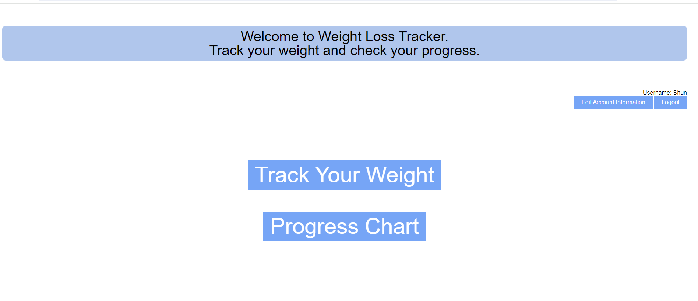
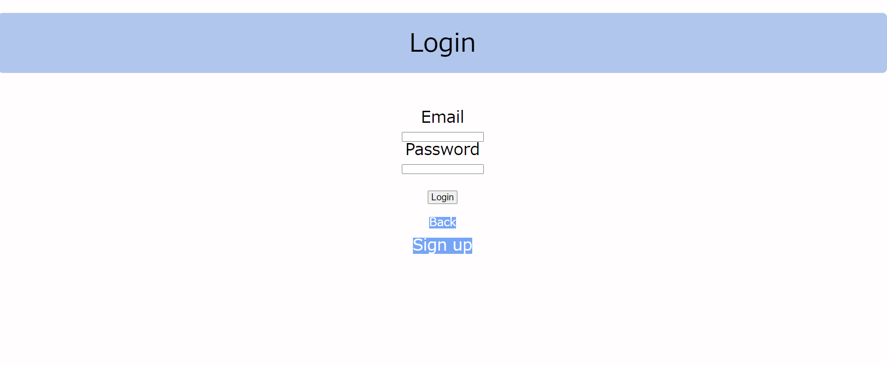
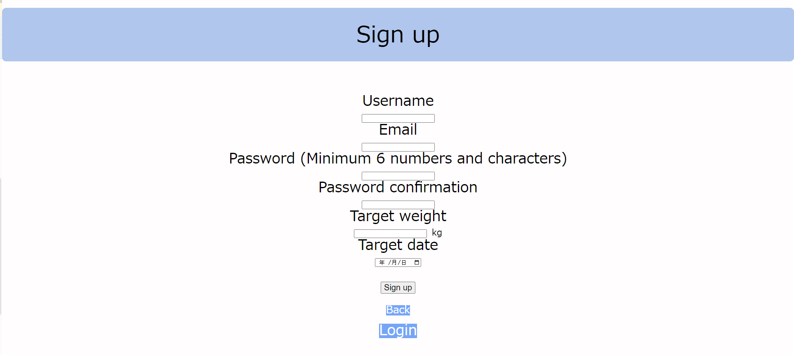
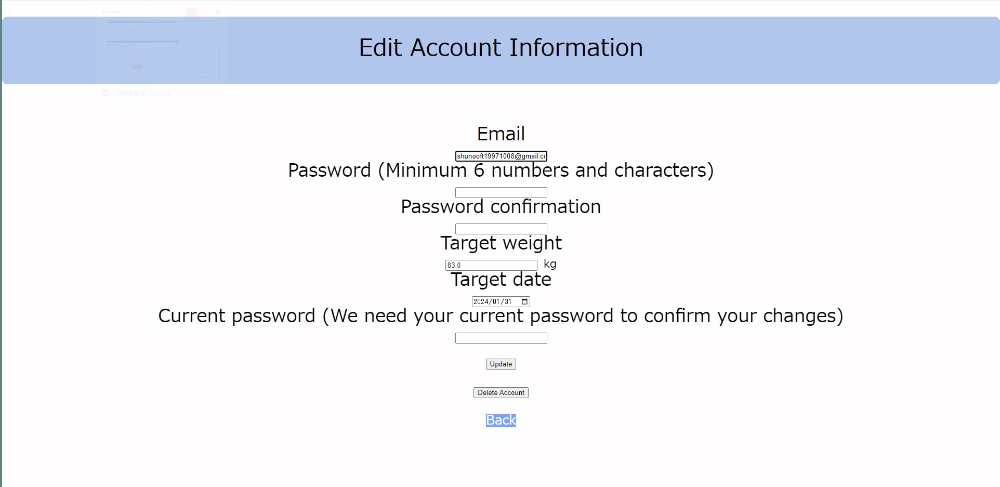
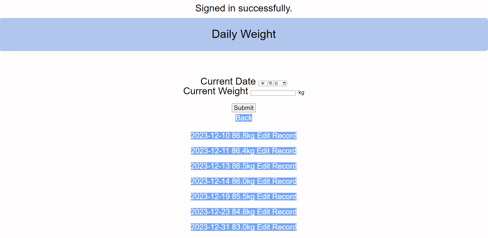
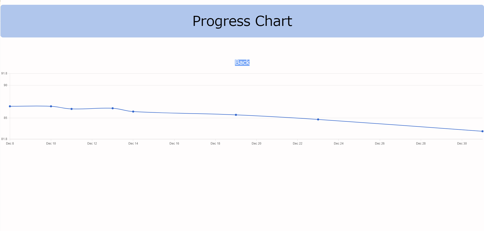
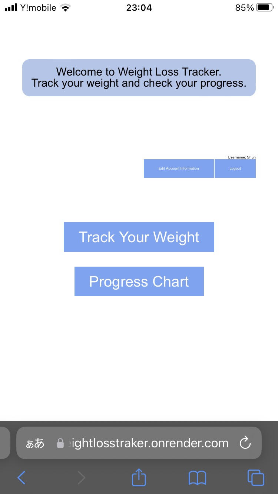
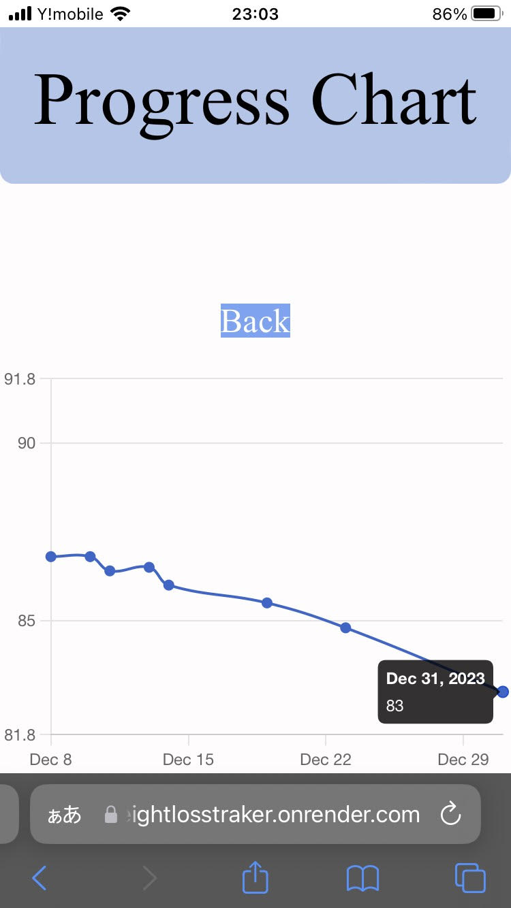
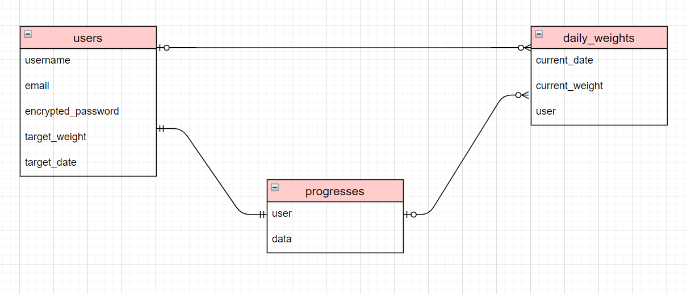

# README

アプリ名: Weight Loss Tracker

アプリケーション概要:
Weight Loss Trackerは、ユーザーの体重管理を支援するアプリケーションです。体重の記録、目標設定、進捗の確認など、ダイエットによる健康管理をサポートします。

URL:
https://weightlosstraker.onrender.com

テスト用アカウント
ユーザー名: [shunooft1997100819971008@gmail.com]
パスワード: [Shunooft1997]

利用方法:
・アカウント作成: 最初にアカウントを作成し、ログインします。
・体重の記録: 「体重の入力(Track your weight)」ページで毎日の体重を入力します。
・進捗のグラフ表示: 「グラフでの進捗確認(Progress chart)」を使って、体重の変化をグラフで確認します。この機能は最初の体重入力後にホームページに表示されます。
・目標の設定: 目標体重と目標期日を設定して、進捗を追跡し管理します。Edit Accountにて目標体重と目標期日は設定変更可能です。

アプリケーションを作成した背景:
 多くの人がダイエットと健康維持のために日々努力していますが、体重管理はその中でも特に難しい課題です。短期間の体重変動に一喜一憂することなく、長期的な目標に焦点を当てることが成功への鍵となります。しかし、食事内容や生理的変動により、体重は短期的に予想外の変動を見せることがしばしばあります。このような変動が挫折の原因となり得ることを理解し、私は「Weight Loss Tracker」を開発しました。このアプリケーションは、毎日の体重を簡単に記録し、長期的な増減傾向を把握できるように設計されています。体重の日々の変動をグラフで視覚化することで、一時的な変化に惑わされず、実際の進捗を正確に追跡することが可能です。私の目標は、ユーザーがダイエットを継続し、健康管理を効果的に行えるように支援することです。このアプリケーションが、多くの人の健康維持とダイエット成功の一助となることを願っています。

実際のアプリの様子（画像）:
・ホームページ:
 

・ログイン、アカウント作成機能:
 
 

・アカウント編集: 目標体重と目標期間の修正可能
 

・「体重を記録する(Track your weight)」: ユーザーは毎日の体重を簡単に記録できます。また記録内容に誤りがあれば編集、削除ができます。
 

・「グラフでの進捗確認(Progress chart)」: 詳細な進捗状況をグラフで確認できます。
 
・携帯での表示:
 
 ![Track your weight]app/assets/(images/phonepic_track_your_weight.jpg)
 

データベース設計:

## users table

| Column             | Type   | Options                   |
|--------------------|--------|---------------------------|
| username           | string | null: false               |
| email              | string | null: false, unique: true |
| encrypted_password | string | null: false               |
| target_weight      | string | null: false               |
| target_date        | string | null: false               |

### Association

- has_many :daily_weights
- has_one :progress_chart

## daily_weights table

| Column             | Type       | Options                        |
|----------------    |------------|--------------------------------|
| current_date       | date       | null: false                    |
| current_weight     | string     | null: false                    |
| user               | references | null: false, foreign_key: true |

### Association

- belongs_to :user
- belongs_to :progress_chart

## progress_charts table

| Column             | Type       | Options                        |
|--------------------|------------|--------------------------------|
| user               | references | null: false, foreign_key: true |
| data               | JSON       | null: false                    |
### Association

- belongs_to :user

開発環境
言語: Ruby, JavaScript
フレームワーク: Ruby on Rails
データベース: PostgreSQL
その他: GitHub

工夫したポイント:
・レスポンシブデザイン: スマートフォンやタブレットでも快適に使用できるようにしました。
・進捗の確認のしやすさ: 私自身がユーザーであり、体重の管理を日頃から行っている人間だからこそ、シンプルかつ進捗の把握のしやすさを重視いたしました。